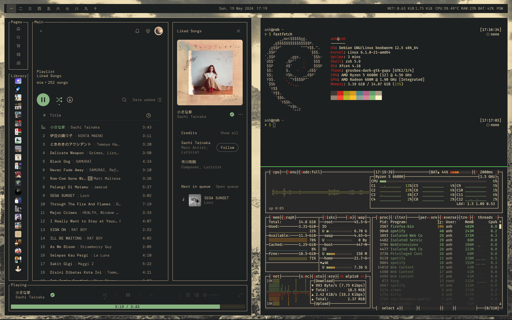
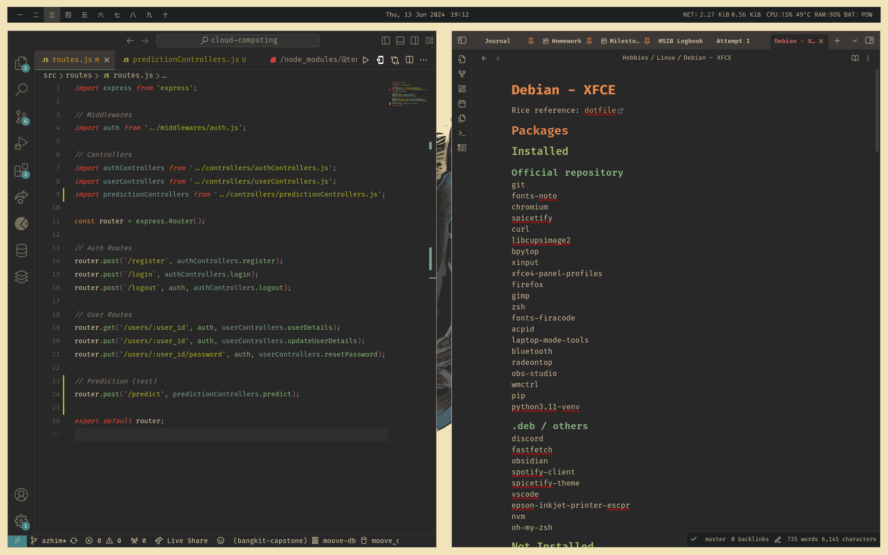

## Themes used
+ **Wallpaper** : [gruvbox-wallpapers - Kojiro.png](https://github.com/AngelJumbo/gruvbox-wallpapers/blob/main/wallpapers/light/Kojiro.png)

+ **GTK Theme** : Modified version of [gruvbox-dark-gtk](https://github.com/jmattheis/gruvbox-dark-gtk)
  + Single monitor: `gruvbox-dark-gtk`
    + Workspace margin: `66 16 16 16`
    + Window Manager Tweaks: Hide frame and title window when maximized 
  + Double monitor `gruvbox-dark-gtk-gaps`
    + Workspace margin: `50 0 0 0`
    + Window Manager Tweaks: Show frame and title window
  
+ **Icon Theme** : [gruvbox-dark-icons-gtk](https://github.com/jmattheis/gruvbox-dark-icons-gtk?tab=readme-ov-file) by jmattheis
  
+ **Cursor Theme** : [Capitaine Cursors (Gruvbox) - White](https://github.com/sainnhe/capitaine-cursors) by sainnhe

+ **Font**: [Firacode](https://github.com/tonsky/FiraCode)
  
+ **Terminal** :
  + xfce4-terminal : [GruvboxDark Hard](https://github.com/gruvbox-community/gruvbox-contrib/blob/master/xfce4-terminal/gruvbox-dark-hard.theme) color scheme by gruvbox-community
  + kitty (current): [Gruvbox Dark Hard](https://raw.githubusercontent.com/gruvbox-community/gruvbox-contrib/master/kitty/gruvbox-dark-hard.conf)

+ **oh-my-zsh**: bureau

+ **VScode theme**: [Gruvbox Theme](https://github.com/jdinhify/vscode-theme-gruvbox)
                    [Gruvbox Material Icon Theme](https://github.com/Jonathan-Harty/vscode-material-icon-theme)

+ **Obsidian theme**: [Material Gruvbox](https://github.com/tonsky/FiraCode)

## Preview

